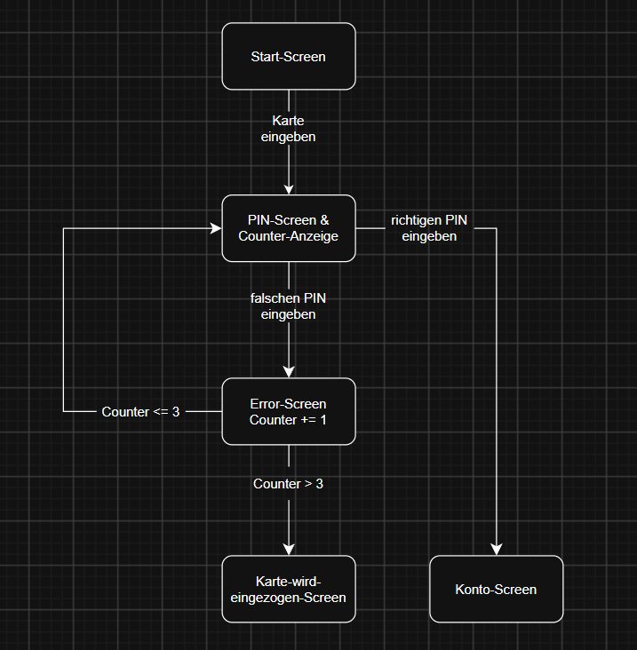

# Übungsaufgabe: Zustandsübergangstest

**Das Szenario beinhaltet einen Geldautomaten (ATM). Um diesen Automaten zu benutzen, muss der Benutzer seine PIN eingeben.**

Der Benutzer sieht zuerst den Startbildschirm, dann den Bildschirm „Warte auf PIN“. Danach sind 3 Versuche möglich. Wenn der PIN-Code korrekt ist, hat der Benutzer Zugriff auf das Konto. Wenn der Benutzer die maximale Anzahl an Versuchen überschreitet, wird die Karte eingezogen.

**Aufgabe:**

1. Bestimme die Zustände, Übergänge und Ereignisse
2. Erstelle die Zustandsübergangstabelle und das Zustandsübergangsdiagramm

---

Zustände:
- Startscreen
- PIN-Screen
- Error-Screen
- Konto-Screen
- Karte-wird-eingezogen-Screen

Übergänge
- Karte eingeben
- PIN eingeben
- Vorgang abbrechen

Ereignisse:
- neuen Zustand erreichen
- Karte einziehen

## Zustandsübergangstabelle

| Zustand       | Übergang               | Ereignis            |
| :---          | :---                   | :---                |
| Start-Screen	| Karte eingeben         | PIN-Screen          |
| PIN-Screen	  | richtigen PIN eingeben | Konto-Screen (Ende) |
| PIN-Screen	  | falschen PIN eingeben  | Error-Screen        |
| PIN-Screen    | Vorgang abbrechen      | Start-Screen        |
| Error-Screen  | interne Evaluation counter > 3  | Karte-wird-eingezogen-Screen (Ende) |
| Error-Screen  | interne Evaluation counter <= 3 | PIN-Screen |
| Error-Screen  | Vorgang abbrechen      | Start-Screen        |

## Zustandsübergangsdiagramm

