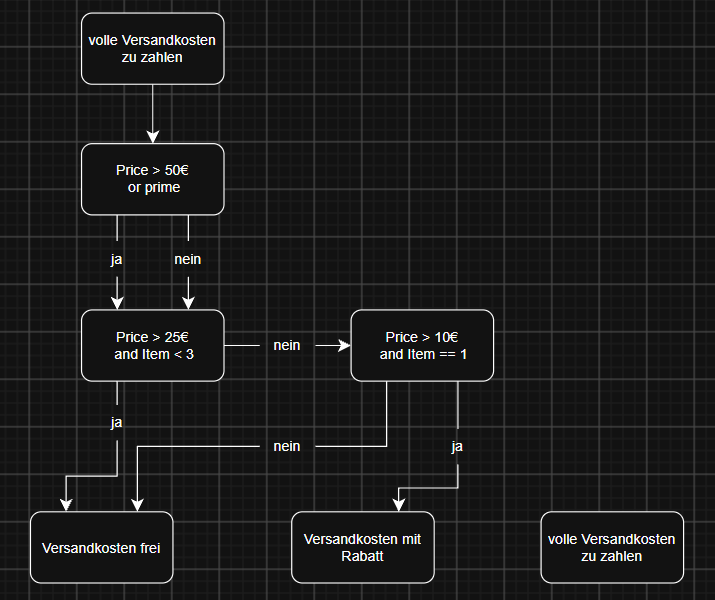
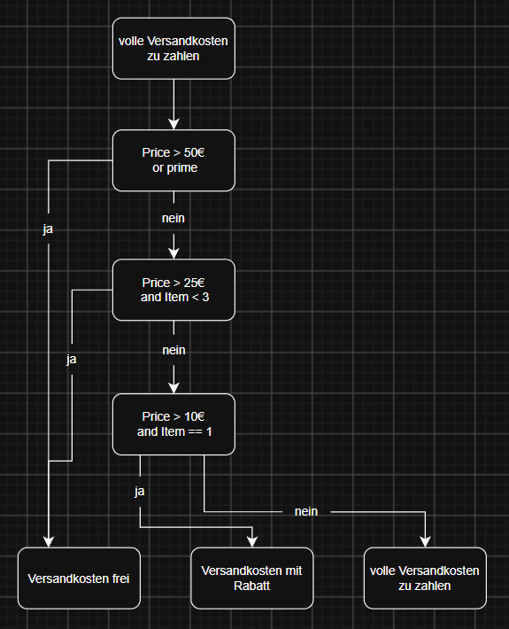

# Statement Coverage

Dein Teamkollege hat einige Testfälle für das folgende Code-Stück erstellt.

### Briefing:
Solange ein Kunde mehr als 50 € ausgibt, sollte der Versand kostenlos sein. Wenn es mehr als 25 € sind, aber weniger als 3 Artikel versendet werden müssen, sollte er ebenfalls kostenlos sein. Wenn es nur einen Artikel gibt, der mehr als 10 € kostet, sollte es einen Rabatt geben, aber der Versand sollte nicht kostenlos sein. In anderen Fällen sollte der volle Versandpreis gezahlt werden.

### Code:
``` Python
def is_shipping_free(price, numberOfItems, isPrimeShoppingMember):
    print("Additional Statement 1")
    if price > 50 or isPrimeShoppingMember:
        print("Additional Statement 2")
    if price > 25 and numberOfItems <3:
        print("Additional Statement 3")
    elif price > 10 and numberOfItems == 1 :
        print("Additional Statement 4(discount)")
        return False
    return True
    print("Additional Statement 5")
```

### Tests:
``` Python
print("----------------")
is_shipping_free(30,2,True)
print("----------------")
is_shipping_free(15,1,False)
print("----------------")
is_shipping_free(15,1,True)
print("----------------")
is_shipping_free(50,1,False)
```

---

### Aufgabe 1:
Zeichne ein Zustandsübergangsdiagramm (gerichteter azyklischer Graph) für diesen Codeabschnitt

---



**Auswertung:** Das Diagramm macht logische Fehler im Code sichtbar. Der Zustand des "Volle Versandkosten zu zahlen" wird nicht erreicht. Daher habe ich den Code wie folgt korrigiert:

``` Python
def is_shipping_free(price, numberOfItems, isPrimeShoppingMember):
    print("Additional Statement 1")
    if price > 50 or isPrimeShoppingMember:
        print("Additional Statement 2")
        return True
    elif price > 25 and numberOfItems < 3:
        print("Additional Statement 3")
        return True
    elif price > 10 and numberOfItems == 1:
        print("Additional Statement 4(discount)")
        return False
    else:
        print("Additional Statement 5")
        return False
```
Danach würde das Diagramm nun so aussehen:



---

### Aufgabe 2:
Berechne die Anweisungsüberdeckung (Statement Coverage) und die Zweigüberdeckung (Branch Coverage)

---

**Statement Coverage (mit korrigierten Code):** 75%

*Die if und elif Zeilen sind abgedeckt, aber die neuen else Zeilen werden mit den alten Tests nicht abgedeckt. Es braucht einen weiteren Test, um auf 100% Statement Coverage zu kommen. Zum Beispiel:*

``` Python
is_shipping_free(30,6,False)
```

**Branch Coverage (mit korrigierten Code):** 75%

*Die if und elif Branches sind abgedeckt, aber der neue else Branch ist mit den alten Tests nicht abgedeckt. Es braucht ebenso den zusätlichen Test, um auf 100% Branch Coverage zu kommen.*
